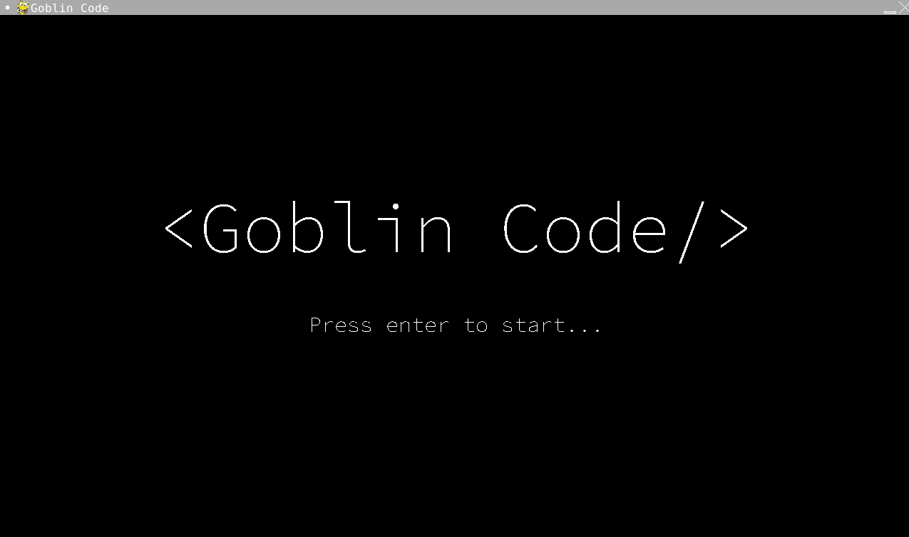

# Goblin Code
### My project for Missouri Hacks 2024 Competition
Welcome to **Goblin Code**, my unique creation for the [Missouri Hacks 2024 High School Competition](https://github.com/user/repo/blob/branch/other_file.md). This competition was an intense experience, where I was challenged to develop a unique and complex program within a mere 4-hour window. My focus was on delivering a product that not only stood out from the rest but also illustrated clarity and maintainability through effectively commented code.

Proudly, Goblin Code emerged as a bug-free and fully functional application, achieving its intended goals with precision. The competition was fierce with 32 skilled participants, and it's an honor to share that Goblin Code was recognized with one of the two Creativity Awards, along with a prize of $25.

## How to play
* Use WASD to move
* Space to shoot </> bullets

## Goal
* Get the highest score possible by shooting the error messages with HTML tags!
* Avoid getting hit by the error messages or you will lose a life!
* When you see a green "Git commit" coming at you - grab it to add an extra life!

## Gameplay screen shots

